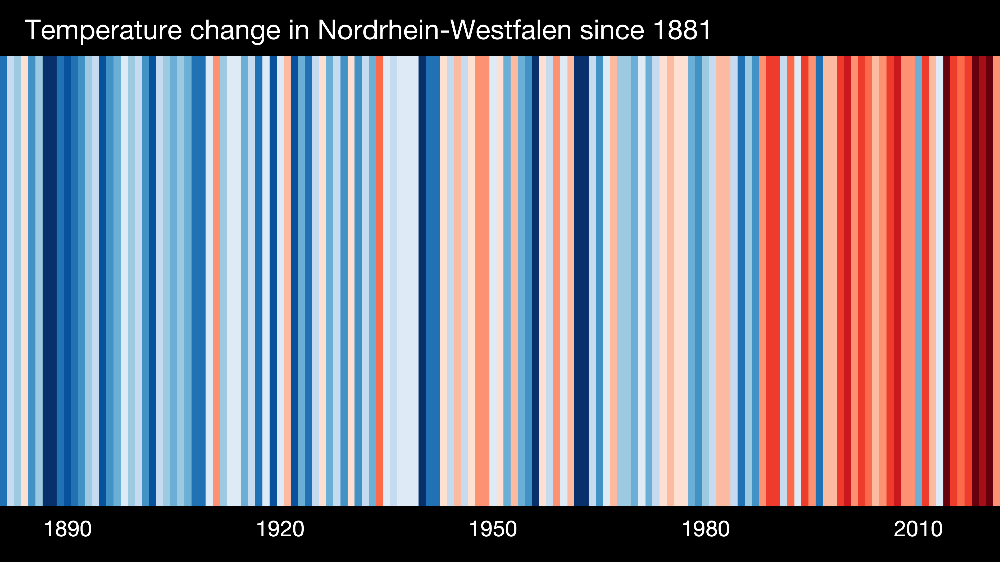
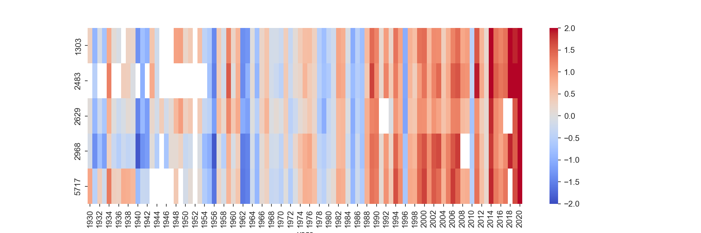
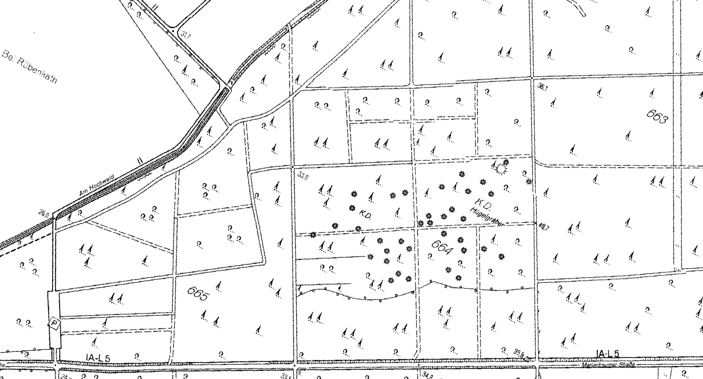

# EE_3.07 Geodata Management Systems SS2023 -   Final Assignment

## 0. General Remarks

1. Due date is **Thursday 2023-08-31T23:59:59CET**. 
1. You can withdraw from exam registration until a week before! 
3. You do not have to write a formal report but you have to sketch the steps you have taken to do the analyses. The code you are uploading as well as additional documentation including a video has to **enable us to redo your work completely!** You must tell us which data you use and where to download it.
4. You can work in **groups of 1 - 3 students**. You have do the **group assignment** in our Moodle course: XYZ   Assign to a group even if you **work alone**.
6. Create **one zip file** which contains all your work but **do not add very big data!** 
7. **USE THE FOLLWING REPO NAME:** `GeoData_SS2023_Final_<Group ID>`, (e.g. GeoData_SS2023_Final_Group_Z). 
8. **Upload** your zip file to the **Moodle** upload area. 
10. Use a `REAMDE.md` file (and more .md-files, if needed) to describe your work. Upload your Python/Jupyter scripts as well as QGIS projects but **do not add very large datasets** (e.g. no satellite images, excessive DTM tiles in XYZ format, etc.) to your project folder. In case you use very large datasets **share the link to the data** in your documentation and/or your code and describe how to download and store it locally. I would expect local folders like  `<YOUR REPO>/data/...`. 
11. In case you **you produce very large datasets** tell us how and **enable us to reproduce your results** instead of flooding your repo with big data.
13. You have to **produce a presentation** (i.e. Powerpoint or similar) and upload it to your git repo. Describe the **individual tasks**. See the **pptx-template** provided in this assignment repo. The pptx template includes a **self-assessment**. In case you work in groups each member has to provide a self-assessment. 
14. You have to **produce one video per group on your presentation** and add it to the zip you upload. **All students must take part in their group's video presentation**. The video is to present the slides with your results. **Do not explain every detail** in the video, e.g. do not explain how to execute your code line by line, etc. Just present each task, your methods, and your results. Refer (name or link) to your code files as well as QGIS projects in your slides such we can reproduce your work if we want.

## 1. Warming Stripes (20 Points)

The British meteorologist Ed Hawkins from the National Centre for Atmospheric Science, University of Reading, came up with the idea to show global warming in terms of colored stripes indicating temperatures above or below a reference temperature with red or blue, respectively. Interactive examples can be studied on the official website [showyourstripes](https://showyourstripes.info/s/europe/germany/nordrheinwestfalen). The development of NRW's mean annual temperature looks like:

 

You have to produce a similar plot but with several stripes in one diagram. Each stripe would represent the development of annual temperatures at a selection of stations. 

**Sub-Task 1.1:**  
Select the stations which are (1) in NRW, (2) still active and (3) started before 1950. It should be **12 stations.** Use **Pandas** to read the station description file [KL_Jahreswerte_Beschreibung_Stationen.txt] (https://opendata.dwd.de/climate_environment/CDC/observations_germany/climate/annual/kl/historical/KL_Jahreswerte_Beschreibung_Stationen.txt) from the historical KL data collection.

Have a look at the available Jupyter notebooks in the geodata git repository. Especially the following could be a good starting point: [gdms0180_DWD_NRW_Annual_Temp_vs_Altitude/gnb0181_DWD_NRW_Annual_Temp_vs_Altitude_V001.ipynb](../gdms0180_DWD_NRW_Annual_Temp_vs_Altitude/gnb0181_DWD_NRW_Annual_Temp_vs_Altitude_V001.ipynb)

Modify the notebook according to your needs. 

**Sub-Task 1.2:**  
Use geopandas in your Jupyter notebook to create a geopackage layer with exactly the 12 stations matching the above criteria. Load this into QGIS and use the NRW WMS service with the topographic map collection as a background map. Create a nicely designed and completely annotated map using EPSG:25832. Use the station IDs together with the station names as labels.  

**Sub-Task 1.3:**  
Extend your Jupyter notebook to **automatically download** (using ftplib, wget, or similar) the annual temperature data from the KL data collection, i.e. which automatically downloads the data according to the selected station IDs in the station info dataframe from here: 
https://opendata.dwd.de/climate_environment/CDC/observations_germany/climate/annual/kl/historical/

**Sub-Task 1.4:**  
Use the dataframe with the temperature time series merged columnwise together with seaborn to plot the waring stripes. The diagram with five stations and not including  recent data (2022 missing) looks like:

 

Create a similar plot but for the 12 selected stations including the annual temperature data of 2022. Let the time series run from 1950 to 2022. Copy the relevant code from notebook 
[gdms0155_DWD_NRW_5_Warming_Stripes/gdms155_DWD_NRW_5_Warming_Stripes.ipynb](../gdms0155_DWD_NRW_5_Warming_Stripes/gdms155_DWD_NRW_5_Warming_Stripes.ipynb). 

Note that for a station with ID $\mathrm{sno}$, the temperature $\Delta T_\mathrm{sno}(k)$ shown in year $k$ is the negative (blue) or positive (red) deviation from the reference temperature ${\bar{T}}_{\mathrm{sno}}$, which is the mean annual temperature of the station between 1961 and 1990. 

$$
\Delta T_\mathrm{sno}(k) = T_\mathrm{sno}(k) - \bar{T}_\mathrm{sno}
$$

## 2. Digitization: Burial Mounds in Uedemer Hochwald (20 Points)

 
*Fig.: Burial mounds in Uedemer Hochwald.*

South west of the village Marienbaum (belongs to Xanten municipality) is the forest "Uedemer Hochwald" in which many burial mounds (German: Hügelgrab (sg.), Hügelgräber (pl.)) from our ancestors of the Hallstatt period (a Celtic culture between 850 and 450 BCE) can be found. The above picture shows a map section with some of the burial mounds indicated as grey dots. 
 
**Task 2.1:**   
Georeference the picture of the map above. Start with the QGIS project `gdms0000_Burial_Mounds_Uedem_V001.qgz` in the assignment folder. Georeference the picture of the map by means of the QGIS Georeferencer together with the layer **DTK10**, the NRW topographic map in 1:10000, already imported from the NRW WMS server and added in the QGIS project. Use crossing forest trails, crossroads, road junctions and other features you can identify on DTK10 as land marks (aka ground control points, GCP) with known coordinates (can be read from the QGIS map canvas). Use EPSG:25832. Add the georeferenced map to the QGIS project.
 
**Task 2.2:**   
Create a hillshade model from the DTM layer. Plot your georeferenced map partly transparent on top of the hillshade model. Compare. What do you observe? How good is the georeferenced map section showing the burial mounds? 

**Task 2.3:**   
Use the DTM (not the hillshapde model!) and measure the typical mound heights relative to their direct environment/neighborhood (not the absolute height above sealevel!). What is their typical elvation in the landscape?

**Task 2.4:**   
Study the hillshade model in direction East-North-East of the burial mounds area and search for weakly visible reectangular structures which are not paths. What do you observe? Do you have a guess about the origin of these patterns? Choose at least one of the structures, digitize it with a polygon and save it as a geopackage.

## 3. OpenHygrisC Nitrate Data: Create a Movie with the QGIS Temporal Controller Connected to PostgreSQL / PostGIS (20 Points)

**Spatio-Temporal Data Anmination using PostGIS together with QGIS Temporal Controller**

In the last lectures we downloaded and engineered the OpenHygrisC groundwater quality data. We loaded the station info as well as the measurement data into the geodatabase. Have a look at the two last lecture videos starting with `Dr. B.: Geodata - 2023-01-20`. 

The activity of producing movies of groundwater chemistry data was not fully accomplished during the lecture phase but I continued and improved the training material in the scope of the funded project OpenHyPE. You can find my latest software versions [**here**](https://github.com/rolfbecker/OpenHyPE).

I presented the Nitrate assessment problem in NRW as well as a technical demonstration at our LatiNet Environmental Conference in the Green FabLab on 2023-02-06. You find the preliminary video (with suboptimal audio) on [**YouTube**](https://www.youtube.com/watch?v=4j71YJ-83M4).

Another  source of information is the training material by the master student Sina Navid on the [EOLab Wiki](https://wiki.eolab.de/doku.php?id=eolab:openhype:start). The information a a bit outdated but still quite useful.

**TASK:**
Get the OpenHypE system running. It consists of OpenHygrisC data (station locations, masurement data, catalog of substances) stored in PostgreSQL/PostGIS with QGIS utilizing a live link to the geodatabase. Start with my OpenHyPE git repo. Read the code and execute it. We have not talked about the database concept of views. They are stored queries (select statements) generally joining and projecting relations. You find some `create view` statements in my Jupyter Notebooks. Furthermore I created several indexes. They are used to improve the performance of data retrieval. They are part of database optimization.

Produce a mpeg (or similar) video with the QGIS Temporal Controller. In the video above I move the time slider manually forth and back. Automize it and produce a video of the Nitrate concentration from the earliest available Nitrate measurement (early 1960's) up to the latest measurement.

## 4. FREE EXERCISE (20 Points)

Do something exiting!

## 5. Produce a Video and Explain your Methods and Achievements. (20 Points)

